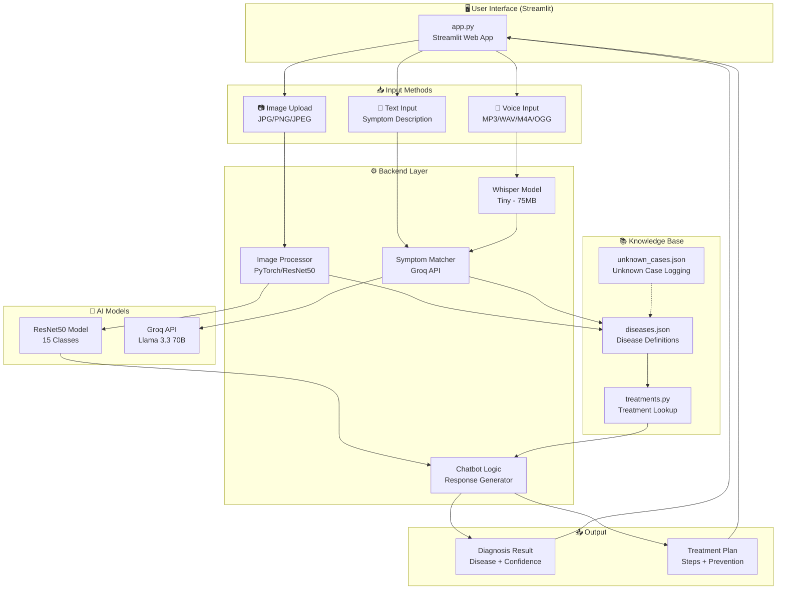
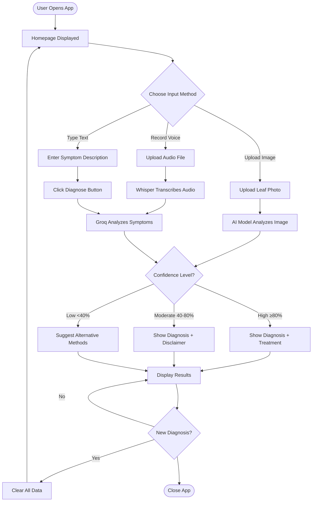

# 🌿 PlantDocBot – AI Plant Disease Diagnosis

**PlantDocBot** is a professional, AI-powered monolithic application for identifying plant diseases. It runs locally using **Streamlit** and combines offline Deep Learning models with online LLM capabilities to provide accurate diagnoses via Image, Voice, or Text.

---

## ✨ Key Features

### 1. 📷 Image Diagnosis (Offline / Local)
- **Model:** ResNet50 (PyTorch) trained on the PlantVillage dataset.
- **Function:** Upload a leaf image -> Model predicts the disease class locally.
- **Classes:** Supports **15 disease classes** (Tomato, Potato, Pepper).
- **Features:** Shows top-3 prediction confidence percentages.

### 2. 🎤 Voice Assistant (Hybrid)
- **Transcription:** Uses **OpenAI Whisper (Local)** to transcribe speech to text on your device.
- **Analysis:** Uses **Groq API** to analyze the transcribed text and match it to known symptoms.
- **Requirements:** Requires `FFmpeg` installed on the system.

### 3. 💬 Text Diagnosis (Online)
- **Model:** **Groq API** (using `llama-3.3-70b-versatile`).
- **Function:** Semantic search matching user descriptions (e.g., "brown spots with halos") to the disease database.
- **UI:** Dedicated "Diagnose" button to prevent accidental API calls.

### 4. ⚙️ Smart UI/UX
- **Single-Mode Logic:** Only one diagnosis mode is active at a time to prevent confusion.
- **Dynamic Reset:** "🔄 New Diagnosis" completely wipes all state, including sticky file uploaders and text inputs.
- **Light Theme:** Enforced professional white background via config.

---

## 🏗️ Architecture Overview

### System Architecture Diagram



---

## 👤 User Flow Diagram



---

## 📁 Project Structure

```
Intern-PlantChatBot-Project/
│
├── 📄 app.py                          # Main entry point - Streamlit UI
├── 📄 requirements.txt                # Python dependencies
├── 📄 .env                            # Environment variables (API keys) - GitIgnored
├── 📄 .gitignore                      # Git ignore rules
├── 📄 LICENSE                         # Project license
│
├── 📂 .streamlit/                     # Streamlit configuration
│   └── config.toml                    # Theme configuration (Light theme)
│
├── 📂 backend/                        # Backend business logic
│   ├── __init__.py                    # Module exports
│   ├── chatbot.py                     # Chatbot response generator
│   ├── symptom_matcher.py             # Text/voice symptom classification
│   ├── voice_handler.py               # Whisper audio transcription
│   ├── groq_fallback.py               # Groq API integration
│   └── api.py                         # Additional API utilities
│
├── 📂 knowledge/                      # Disease knowledge base
│   ├── __init__.py                    # Module exports
│   ├── diseases.json                  # Disease definitions & symptoms
│   ├── treatments.py                  # Treatment lookup & formatting
│   └── unknown_cases.json             # Unknown case logging
│
├── 📂 database/                       # Database layer (SQLite)
│   ├── __init__.py
│   ├── db.py                          # Database connection
│   ├── models.py                      # SQLAlchemy models
│   ├── seed.py                        # Database seeding
│   └── plantdocbot.db                 # SQLite database file
│
├── 📂 models/                         # Trained ML models
│   └── resnet50_plantvillage_checkpoint.pth  # PyTorch model weights
│
├── 📂 data/                           # Sample/test data
│   ├── *.JPG                          # Sample leaf images
│   └── *.mp3                          # Sample audio files
│
├── 📂 .venv/                          # Python virtual environment
│
├── 📂 .git/                           # Git repository
│
├── 📄 train.ipynb                     # Model training notebook
└── 📄 train2.ipynb                    # Secondary training notebook
```

### 📂 Folder Explanations

#### `/app.py`
The main application entry point. This is a Streamlit-based web application that:
- Renders the user interface with tabs for Image, Voice, and Text inputs
- Loads the PyTorch ResNet50 model for image classification
- Manages session state for diagnosis modes
- Displays diagnosis results with treatment recommendations
- Handles confidence-based result formatting

#### `/backend/`
Core business logic layer containing:

| File | Purpose |
|------|---------|
| `chatbot.py` | Response generator for greetings, disease lists, and treatment info |
| `symptom_matcher.py` | Wrapper for text/voice symptom classification using Groq API |
| `voice_handler.py` | Local Whisper model integration for speech-to-text transcription |
| `groq_fallback.py` | Groq API client for semantic symptom classification using Llama 3.3 |
| `api.py` | Additional API utilities and voice processing endpoint |
| `__init__.py` | Module exports for clean imports |

**Key Functions:**
- `text_diagnosis()` - Classify symptoms from text
- `process_voice_input()` - Process audio files through Whisper + Groq
- `transcribe_audio()` - Convert speech to text locally
- `classify_symptoms_with_groq()` - LLM-based disease matching

#### `/knowledge/`
Structured disease database containing:

| File | Purpose |
|------|---------|
| `diseases.json` | JSON database with disease definitions, symptoms, treatments, and prevention |
| `treatments.py` | Treatment lookup logic with confidence-aware handling |
| `unknown_cases.json` | Logs unknown disease cases for future improvement |
| `__init__.py` | Module exports |

**Disease Data Structure:**
```json
{
  "Disease_Key": {
    "disease": "Human-readable name",
    "crop": "Plant type (Tomato/Potato/Pepper)",
    "type": "Fungal/Bacterial/Viral",
    "severity": "Low/Medium/High",
    "cause": "Causal agent",
    "symptoms": ["list", "of", "symptoms"],
    "treatment": ["treatment", "steps"],
    "prevention": ["prevention", "tips"]
  }
}
```

**Key Functions:**
- `get_treatment()` - Retrieve treatment info with confidence handling
- `format_treatment_response()` - Format treatment as markdown
- `get_uncertain_response()` - Handle low-confidence predictions
- `_log_unknown_case()` - Log unknown diseases for review

#### `/database/`
SQLite database layer for data persistence:

| File | Purpose |
|------|---------|
| `db.py` | Database connection and session management |
| `models.py` | SQLAlchemy ORM models |
| `seed.py` | Database seeding with initial data |
| `plantdocbot.db` | SQLite database file |
| `__init__.py` | Module initialization |

#### `/models/`
Contains the trained deep learning model:

| File | Purpose |
|------|---------|
| `resnet50_plantvillage_checkpoint.pth` | PyTorch ResNet50 trained on PlantVillage dataset (15 classes) |

**Model Classes:**
1. Pepper__bell___Bacterial_spot
2. Pepper__bell___healthy
3. Potato___Early_blight
4. Potato___Late_blight
5. Potato___healthy
6. Tomato___Bacterial_spot
7. Tomato___Early_blight
8. Tomato___Late_blight
9. Tomato___Leaf_Mold
10. Tomato___Septoria_leaf_spot
11. Tomato___Spider_mites Two-spotted_spider_mite
12. Tomato___Target_Spot
13. Tomato___Tomato_Yellow_Leaf_Curl_Virus
14. Tomato___Tomato_mosaic_virus
15. Tomato___healthy

#### `/data/`
Sample/test data directory containing:
- Sample leaf images (JPG format) for testing
- Sample audio files (MP3 format) for voice testing

#### `/.streamlit/`
Streamlit configuration directory:

| File | Purpose |
|------|---------|
| `config.toml` | UI theme configuration (light mode, colors, fonts) |

**Theme Settings:**
- Base: Light
- Primary Color: #2e7d32 (Green)
- Background: #ffffff (White)
- Font: Sans Serif

#### `/` (Root)
Project root files:

| File | Purpose |
|------|---------|
| `requirements.txt` | Python package dependencies |
| `.env` | Environment variables (GROQ_API_KEY) - **GitIgnored** |
| `.gitignore` | Git ignore patterns |
| `LICENSE` | Project license |
| `train.ipynb` | Jupyter notebook for model training |
| `train2.ipynb` | Secondary training notebook |

---

## 🛠️ Tech Stack

| Component | Technology | Role |
|-----------|------------|------|
| **Core Framework** | Streamlit | UI & Application Logic |
| **Deep Learning** | PyTorch / Torchvision | Image Classification (ResNet50) |
| **Speech-to-Text** | OpenAI Whisper | Local Audio Transcription |
| **LLM / API** | Groq (`llama-3.3-70b-versatile`) | Semantic Symptom Analysis |
| **Data Handling** | Pandas / JSON | Knowledge Base Management |
| **Database** | SQLite / SQLAlchemy | Data persistence |
| **Environment** | python-dotenv | Configuration management |

---

## 🚀 Installation & Setup

### 1. Prerequisites
- **Python 3.9+**
- **FFmpeg:** Required for Whisper to process audio files.
  - *Windows:* `winget install Gyan.FFmpeg` or separate install.
  - *Linux:* `sudo apt install ffmpeg`
  - *Mac:* `brew install ffmpeg`
- **Groq API Key:** Required for Text/Voice features. Get it from [Groq Console](https://console.groq.com).

### 2. Clone & Environment
```bash
git clone https://github.com/springboardmentor88888-mahaprasad/Intern-PlantChatBot-Project.git
cd Intern-PlantChatBot-Project

# Create Virtual Environment
python -m venv .venv
.venv\Scripts\activate  # Windows
# source .venv/bin/activate  # Mac/Linux
```

### 3. Install Dependencies
```bash
pip install -r requirements.txt
```

### 4. Configure API Key
Create a `.env` file in the root directory:
```bash
GROQ_API_KEY=gsk_your_actual_api_key_here
```

### 5. Run the Application
```bash
streamlit run app.py
```

---

## 🐳 Docker Setup

### Quick Start with Docker

#### Option 1: Using Docker Compose (Recommended)

1. **Ensure `docker-compose.yml` exists** (see Docker files section below)

2. **Build and Run:**
```bash
# Create .env file with your API key
echo "GROQ_API_KEY=gsk_your_key_here" > .env

# Build and start the container
docker-compose up --build

# Access the app at http://localhost:8501
```

#### Option 2: Using Docker Run

```bash
# Build the image
docker build -t plantdocbot .

# Run the container
docker run -p 8501:8501 \
  -e GROQ_API_KEY=gsk_your_key_here \
  -v $(pwd)/models:/app/models \
  -v $(pwd)/knowledge:/app/knowledge \
  plantdocbot
```

#### Option 3: Development Mode with Volume Mounting

```bash
# Run with hot-reload for development
docker run -p 8501:8501 \
  -e GROQ_API_KEY=gsk_your_key_here \
  -v $(pwd):/app \
  -v /app/.venv \
  plantdocbot \
  streamlit run app.py --server.port=8501 --server.address=0.0.0.0
```

### Docker Environment Variables

| Variable | Required | Description |
|----------|----------|-------------|
| `GROQ_API_KEY` | Yes | Groq API key for text/voice diagnosis |
| `STREAMLIT_SERVER_PORT` | No | Port to run Streamlit (default: 8501) |
| `STREAMLIT_SERVER_ADDRESS` | No | Bind address (default: 0.0.0.0) |
| `STREAMLIT_BROWSER_GATHER_USAGE_STATS` | No | Disable telemetry (default: false) |

### Docker Files Structure

The project includes the following Docker-related files:

```
├── Dockerfile              # Main Docker image definition
├── docker-compose.yml      # Docker Compose configuration
├── .dockerignore          # Files to exclude from Docker context
└── README.md              # This documentation
```

---

## 🌱 Supported Diseases

The system is optimized for **Tomato** plants but trained on a wider set:

### Tomato Diseases:
- 🦠 Bacterial Spot
- 🍄 Early Blight
- 🍄 Late Blight
- 🍄 Leaf Mold
- 🍄 Septoria Leaf Spot
- 🕷️ Spider Mites (Two-spotted spider mite)
- 🎯 Target Spot
- 🦠 Yellow Leaf Curl Virus
- 🦠 Mosaic Virus
- ✅ Healthy

### Potato Diseases:
- 🍄 Early Blight
- 🍄 Late Blight
- ✅ Healthy

### Pepper Diseases:
- 🦠 Bacterial Spot
- ✅ Healthy

---

## 🔧 Configuration

### Environment Variables

Create a `.env` file with:

```bash
# Required
GROQ_API_KEY=gsk_your_actual_api_key_here

# Optional
STREAMLIT_SERVER_PORT=8501
STREAMLIT_SERVER_ADDRESS=0.0.0.0
STREAMLIT_BROWSER_GATHER_USAGE_STATS=false
```

### Streamlit Configuration

Edit `.streamlit/config.toml`:

```toml
[theme]
base="light"
primaryColor="#2e7d32"
backgroundColor="#ffffff"
secondaryBackgroundColor="#f0f2f6"
textColor="#000000"
font="sans serif"

[server]
port = 8501
address = "0.0.0.0"
```

---

## ⚠️ Troubleshooting

### 1. "FFmpeg not found" error:
- Ensure FFmpeg is installed and added to your system PATH.
- **Windows:** `winget install Gyan.FFmpeg`
- **Linux:** `sudo apt install ffmpeg`
- **Mac:** `brew install ffmpeg`
- Restart the terminal after installing FFmpeg.

### 2. "Model file not found":
- Ensure `models/resnet50_plantvillage_checkpoint.pth` exists.
- The model file should be ~100MB. If it's smaller, it may be corrupted.

### 3. "Groq API Error":
- Check your `.env` file and ensure the API key is valid.
- Verify the key starts with `gsk_`.
- Check your Groq console for API usage limits.

### 4. Whisper model download fails:
- The Whisper "tiny" model (~75MB) downloads automatically on first use.
- Ensure stable internet connection for initial download.
- The model is cached locally after first use.

### 5. Docker container exits immediately:
- Check logs: `docker logs plantdocbot`
- Ensure all environment variables are set correctly.
- Verify FFmpeg is installed in the Docker image.

### 6. Low image prediction confidence:
- Ensure the image is clear and well-lit.
- The leaf should be centered and in focus.
- Avoid shadows and glare on the leaf surface.
- Supported formats: JPG, JPEG, PNG.

---

## 📝 API Documentation

### Backend Functions

#### Image Diagnosis
```python
from backend import text_diagnosis

# Diagnose from text description
disease_key = text_diagnosis("brown spots with yellow halos")
# Returns: "Tomato___Early_blight"
```

#### Voice Processing
```python
from backend import process_voice_input

# Process audio file
result = process_voice_input("/path/to/audio.mp3")
# Returns: {
#     "transcription": "my tomato has brown spots",
#     "disease_key": "Tomato___Early_blight",
#     "error": None
# }
```

#### Treatment Lookup
```python
from knowledge import get_treatment, format_treatment_response

# Get treatment info
treatment = get_treatment("Tomato___Late_blight", confidence=0.85)

# Format as markdown
response = format_treatment_response("Tomato___Late_blight", confidence=0.85)
```

---

## 🔄 Development Workflow

### Adding New Diseases

1. Edit `knowledge/diseases.json`:
```json
"New_Disease_Key": {
    "disease": "Human Readable Name",
    "crop": "Crop Type",
    "type": "Fungal/Bacterial/Viral",
    "severity": "Low/Medium/High",
    "cause": "Causal agent",
    "symptoms": ["symptom1", "symptom2"],
    "treatment": ["step1", "step2"],
    "prevention": ["tip1", "tip2"]
}
```

2. The system will automatically pick up the new disease.

### Training Custom Models

Use the provided Jupyter notebooks:
- `train.ipynb` - Main training notebook
- `train2.ipynb` - Alternative training approach

### Running Tests

```bash
# Install test dependencies
pip install pytest pytest-cov

# Run tests
pytest tests/
```

---

## 📊 Performance Metrics

| Feature | Speed | Accuracy | Resource Usage |
|---------|-------|----------|----------------|
| Image Diagnosis | ~2-3 seconds | 85-95% (high conf) | Medium (GPU optional) |
| Voice Processing | ~5-10 seconds | Depends on audio quality | Low |
| Text Diagnosis | ~2-4 seconds | 80-90% | Low |

---

## 🤝 Contributing

1. Fork the repository
2. Create a feature branch: `git checkout -b feature/amazing-feature`
3. Commit changes: `git commit -m 'Add amazing feature'`
4. Push to branch: `git push origin feature/amazing-feature`
5. Open a Pull Request

---

## 📄 License

This project is licensed under the MIT License - see the [LICENSE](LICENSE) file for details.

---

## 👥 Team

**Mentor:** Mahaprasad Jena  
*Intern project for automated plant disease diagnosis using AI.*

---

## 🙏 Acknowledgments

- [PlantVillage Dataset](https://github.com/spMohanty/PlantVillage-Dataset) - Training data
- [Groq](https://groq.com) - LLM API
- [Streamlit](https://streamlit.io) - UI Framework
- [PyTorch](https://pytorch.org) - Deep Learning Framework
- [OpenAI Whisper](https://github.com/openai/whisper) - Speech recognition

---

## 📞 Support

For issues and feature requests, please use the [GitHub Issues](https://github.com/springboardmentor88888-mahaprasad/Intern-PlantChatBot-Project/issues) page.

---

## 🐳 Docker Files

The following Docker configuration files are included in this project:

### 1. Dockerfile
Located at: `./Dockerfile`
- Defines the Docker image build process
- Based on Python 3.11 slim
- Includes FFmpeg for audio processing
- Configures Streamlit application

### 2. docker-compose.yml
Located at: `./docker-compose.yml`
- Simplifies container orchestration
- Handles environment variables
- Manages volume mounts for persistent data

### 3. .dockerignore
Located at: `./.dockerignore`
- Excludes unnecessary files from Docker build context
- Improves build performance
- Reduces image size

**Note:** These files contain dummy code placeholders marked with `# TODO:` comments. Replace them with your actual implementation as needed.

---

**Happy Plant Diagnosing! 🌱🤖**
