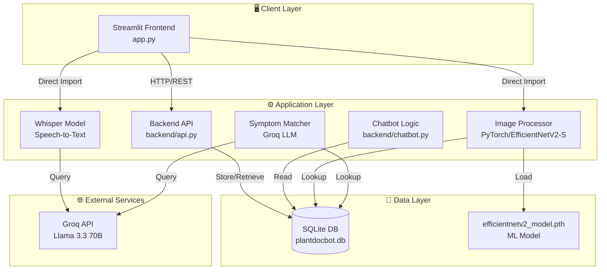
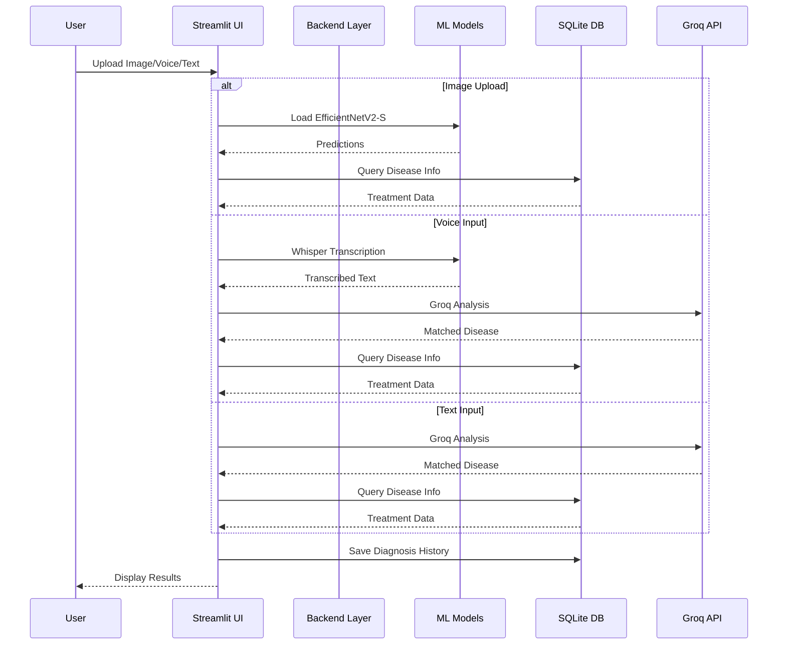

# 🌿 PlantDocBot – AI Plant Disease Diagnosis

**PlantDocBot** is a professional, AI-powered monolithic application for identifying plant diseases. It runs locally using **Streamlit** and combines offline Deep Learning models with online LLM capabilities to provide accurate diagnoses via Image, Voice, or Text.

> All configuration is centralised in `config/settings.py` — no hardcoded values in application code.

---

## ✨ Key Features

### 1. 📷 Image Diagnosis (Offline / Local)
- **Model:** EfficientNetV2-Small (PyTorch + timm) trained on PlantVillage + PlantDoc datasets.
- **Function:** Upload a leaf image → Model predicts the disease class locally.
- **Classes:** Supports **28 classes** across **13+ crops** (Apple, Blueberry, Cherry, Corn, Grape, Peach, Pepper, Potato, Raspberry, Soybean, Squash, Strawberry, Tomato + Not_a_Plant rejection).
- **Features:** Shows top-3 prediction confidence percentages.

### 2. 🎤 Voice Assistant (Hybrid)
- **Transcription:** Uses **OpenAI Whisper (Local)** to transcribe speech to text on your device.
- **Analysis:** Uses **Groq API** to analyze the transcribed text and match it to known symptoms.
- **Requirements:** Requires `FFmpeg` installed on the system.

### 3. 💬 Text Diagnosis (Online)
- **Model:** **Groq API** (using `llama-3.3-70b-versatile`).
- **Function:** Semantic search matching user descriptions (e.g., "brown spots with halos") to the disease database.
- **UI:** Dedicated "Diagnose" button to prevent accidental API calls.

### 4. ⚙️ Smart UI/UX
- **Single-Mode Logic:** Only one diagnosis mode is active at a time to prevent confusion.
- **Dynamic Reset:** "🔄 New Diagnosis" completely wipes all state, including sticky file uploaders and text inputs.
- **Light Theme:** Enforced professional white background via config.

---

## 🏗️ System Architecture



---

## 👤 User Flow Diagram


---

## 🔄 Data Flow Diagram



---

## 📁 Project Structure

```
Intern-PlantChatBot-Project/
│
├── 📄 app.py                          # Main entry point - Streamlit UI
├── 📄 requirements.txt                # Python dependencies
├── 📄 .env                            # Environment variables (API keys) - GitIgnored
├── 📄 .env.example                    # Environment variables template
├── 📄 .gitignore                      # Git ignore rules
├── 📄 LICENSE                         # Project license
├── 📄 Dockerfile                      # Docker image definition
├── 📄 docker-compose.yml              # Docker Compose configuration
├── 📄 .dockerignore                   # Docker ignore rules
│
├── 📂 .streamlit/                     # Streamlit configuration
│   └── config.toml                    # Theme configuration (Light theme)
│
├── 📂 frontend/                       # Frontend module
│   ├── __init__.py                    # Module initialization
│   └── main.py                        # Additional frontend utilities
│
├── 📂 backend/                        # Backend business logic
│   ├── __init__.py                    # Module exports
│   ├── api.py                         # FastAPI REST API endpoints
│   ├── app.py                         # Voice processing pipeline
│   ├── chatbot.py                     # Chatbot response generator
│   ├── symptom_matcher.py             # Text/voice symptom classification
│   ├── voice_handler.py               # Whisper audio transcription
│   └── groq_fallback.py               # Groq API integration
│
├── 📂 config/                          # Centralized configuration
│   ├── __init__.py                    # Re-exports from settings
│   └── settings.py                    # All config loaded from .env
│
├── 📂 database/                       # Database layer (SQLite)
│   ├── __init__.py                    # Module initialization & exports
│   ├── db.py                          # Database query functions
│   ├── models.py                      # SQLAlchemy ORM models
│   ├── seed.py                        # Database seeding with disease data
│   └── plantdocbot.db                 # SQLite database file
│
├── 📂 models/                         # Trained ML models
│   └── resnet50_plantvillage_checkpoint1.pth # EfficientNetV2-S weights (28 classes)
│
├── 📂 testing_data/                   # Test data samples
│   ├── *.JPG                          # Sample leaf images
│   └── *.mp3                          # Sample audio files
│
├── 📂 .venv/                          # Python virtual environment
│
├── 📂 .git/                           # Git repository
│
├── 📄 train.ipynb                     # v1 Training notebook (initial experiments)
├── 📄 train2.ipynb                    # v2 Training — ResNet50, 15 classes, PlantVillage only
└── 📄 Train3.ipynb                    # v3 Training — EfficientNetV2-S, 28 classes, PlantVillage + PlantDoc
```

---

## 📂 Folder Explanations

### `/` (Root)
Main application and configuration files:

| File | Purpose |
|------|---------|
| `app.py` | Main Streamlit application entry point |
| `requirements.txt` | Python package dependencies |
| `.env` | Environment variables (API keys) - **GitIgnored** |
| `.env.example` | Template for environment variables |
| `.gitignore` | Git ignore patterns |
| `LICENSE` | Project license |
| `Dockerfile` | Docker image build configuration |
| `docker-compose.yml` | Docker Compose orchestration |
| `.dockerignore` | Files excluded from Docker context |
| `train.ipynb` | v1 Training notebook (initial experiments) |
| `train2.ipynb` | v2 Training — ResNet50, 15 classes, PlantVillage only |
| `Train3.ipynb` | v3 Training — EfficientNetV2-S, 28 classes, PlantVillage + PlantDoc |

### `/frontend/`
Frontend module containing additional UI components:

| File | Purpose |
|------|---------|
| `__init__.py` | Module initialization |
| `main.py` | Additional frontend utilities and components |

### `/backend/`
Core business logic layer with FastAPI:

| File | Purpose |
|------|---------|
| `__init__.py` | Module exports and initialization |
| `api.py` | FastAPI REST API endpoints for HTTP requests |
| `app.py` | Voice processing pipeline |
| `chatbot.py` | Chatbot response generator and conversation logic |
| `symptom_matcher.py` | Text/voice symptom classification using Groq API |
| `voice_handler.py` | OpenAI Whisper integration for speech-to-text |
| `groq_fallback.py` | Groq API client for LLM-based classification |

**Key Functions:**
- `text_diagnosis()` - Classify symptoms from text input
- `process_voice_input()` - Process audio through Whisper + Groq pipeline
- `transcribe_audio()` - Convert speech to text locally
- `classify_symptoms_with_groq()` - LLM-based semantic disease matching

### `/database/`
SQLite database persistence layer with disease knowledge:

| File | Purpose |
|------|---------|
| `__init__.py` | Module initialization and exports |
| `db.py` | Database query functions for diseases, treatments, history |
| `models.py` | SQLAlchemy ORM models (Disease, Symptom, Treatment, etc.) |
| `seed.py` | Database seeding with disease data, symptoms, treatments |
| `plantdocbot.db` | SQLite database file with all disease information |

**Key Functions:**
- `get_treatment()` — Retrieve treatment info with confidence handling
- `format_treatment_response()` — Format treatment as markdown
- `resolve_disease_key()` — Map model output class names → database keys
- `get_uncertain_response()` — Handle low-confidence predictions
- `get_all_disease_keys()` — Get list of all supported diseases
- `init_db()` — Initialize database with tables and seed data

**Database Schema:**
- `diseases` - Disease definitions (key, name, crop, type, severity, cause)
- `symptoms` - Disease symptoms linked to diseases
- `treatments` - Treatment steps for each disease
- `prevention` - Prevention tips for each disease
- `diagnosis_history` - User diagnosis history (if implemented)

### `/models/`
Trained machine learning models:

| File | Purpose |
|------|---------|
| `resnet50_plantvillage_checkpoint1.pth` | EfficientNetV2-Small trained on PlantVillage + PlantDoc (28 classes) |

**Model Classes (28 total across 13 crops + rejection):**

| # | Class Name | Mapped Disease |
|---|-----------|----------------|
| 1 | Apple Scab Leaf | Apple Scab |
| 2 | Apple leaf | Apple Healthy |
| 3 | Apple rust leaf | Cedar Apple Rust |
| 4 | Bell_pepper leaf | Bell Pepper Healthy |
| 5 | Bell_pepper leaf spot | Bell Pepper Bacterial Spot |
| 6 | Blueberry leaf | Blueberry Healthy |
| 7 | Cherry leaf | Cherry Powdery Mildew |
| 8 | Corn Gray leaf spot | Corn Cercospora |
| 9 | Corn leaf blight | Corn Northern Leaf Blight |
| 10 | Corn rust leaf | Corn Common Rust |
| 11 | Not_a_Plant | _(rejection class)_ |
| 12 | Peach leaf | Peach Bacterial Spot |
| 13 | Potato leaf early blight | Potato Early Blight |
| 14 | Potato leaf late blight | Potato Late Blight |
| 15 | Raspberry leaf | Raspberry Healthy |
| 16 | Soyabean leaf | Soybean Healthy |
| 17 | Squash Powdery mildew leaf | Squash Powdery Mildew |
| 18 | Strawberry leaf | Strawberry Leaf Scorch |
| 19 | Tomato Early blight leaf | Tomato Early Blight |
| 20 | Tomato Septoria leaf spot | Tomato Septoria |
| 21 | Tomato leaf | Tomato Healthy |
| 22 | Tomato leaf bacterial spot | Tomato Bacterial Spot |
| 23 | Tomato leaf late blight | Tomato Late Blight |
| 24 | Tomato leaf mosaic virus | Tomato Mosaic Virus |
| 25 | Tomato leaf yellow virus | Tomato Yellow Leaf Curl |
| 26 | Tomato mold leaf | Tomato Leaf Mold |
| 27 | grape leaf | Grape Healthy |
| 28 | grape leaf black rot | Grape Black Rot |

### `/testing_data/`
Sample test data for development and testing:

| Content | Purpose |
|---------|---------|
| `*.JPG` | Sample leaf images for testing image diagnosis |
| `*.mp3` | Sample audio files for testing voice diagnosis |

### `/.streamlit/`
Streamlit configuration:

| File | Purpose |
|------|---------|
| `config.toml` | UI theme configuration (colors, fonts, layout) |

**Theme Settings:**
- Base: Light
- Primary Color: #2e7d32 (Green)
- Background: #ffffff (White)
- Font: Sans Serif

---

## 🧠 Model Training Journey

### v2 — ResNet50 on PlantVillage (`train2.ipynb`)

| Aspect | Detail |
|--------|--------|
| **Architecture** | ResNet50 (torchvision, pretrained) |
| **Dataset** | [PlantVillage](https://www.kaggle.com/datasets/emmarex/plantdisease) — lab-controlled images |
| **Classes** | 15 (Tomato, Potato, Pepper only) |
| **Training** | SGD, 15 epochs, basic augmentation |
| **Test Accuracy** | **99.9%** |

> [!WARNING]
> The 99.9% accuracy was **misleading** — PlantVillage images are taken in controlled lab conditions with uniform backgrounds. The model failed on real-world, diverse images.

### v3 — EfficientNetV2-S on PlantVillage + PlantDoc (`Train3.ipynb`) ✅

| Aspect | Detail |
|--------|--------|
| **Architecture** | EfficientNetV2-Small (timm, pretrained on ImageNet) |
| **Datasets** | [PlantVillage](https://www.kaggle.com/datasets/emmarex/plantdisease) + [PlantDoc](https://www.kaggle.com/datasets/abdulhasibuddin/plant-doc-dataset) + Not_a_Plant (ImageNet subset) |
| **Classes** | **28** across **13 crops** + Not_a_Plant rejection |
| **Training** | 40 epochs, AdamW (lr=1e-3), CosineAnnealing, Label Smoothing (0.1), Mixed Precision |
| **Augmentation** | RandomResizedCrop, ColorJitter, GaussianBlur, RandomErasing, RandomAffine |
| **Val Accuracy** | **80.86%** |
| **Not_a_Plant F1** | **0.99** (near-perfect non-plant rejection) |

> [!IMPORTANT]
> The v3 model accuracy is lower on paper (80.86% vs 99.9%), but it works **much better in the real world** because:
> 1. PlantDoc images are taken with phones in fields — diverse backgrounds, lighting, angles
> 2. Combined dataset forces the model to learn actual disease features, not lab backgrounds
> 3. Not_a_Plant class (ImageNet subset) provides robust non-plant rejection (F1=0.99)

### Key Improvements (v2 → v3)
- **More Crops:** 3 → 13 (Apple, Blueberry, Cherry, Corn, Grape, Peach, Raspberry, Soybean, Squash, Strawberry)
- **Better Architecture:** ResNet50 → EfficientNetV2-S (more efficient, better feature extraction)
- **Real-world Data:** Lab-only → Lab + Field images
- **Non-plant Rejection:** Added `Not_a_Plant` class to reject non-leaf uploads
- **Training Techniques:** Label smoothing, CosineAnnealing LR, mixed precision

---

## 🛠️ Tech Stack

| Component | Technology | Role |
|-----------|------------|------|
| **Core Framework** | Streamlit | UI & Application Logic |
| **Backend API** | FastAPI + Uvicorn | REST API endpoints (auto-docs at /docs) |
| **Deep Learning** | PyTorch / timm | Image Classification (EfficientNetV2-S) |
| **Speech-to-Text** | OpenAI Whisper | Local Audio Transcription |
| **LLM / API** | Groq (`llama-3.3-70b-versatile`) | Semantic Symptom Analysis |
| **Database** | SQLite + SQLAlchemy | Data persistence |
| **Environment** | python-dotenv | Configuration management |
| **Containerization** | Docker + Docker Compose | Deployment |

---

## 🚀 Installation & Setup

### 1. Prerequisites
- **Python 3.9+**
- **FFmpeg:** Required for Whisper audio processing
  - *Windows:* `winget install Gyan.FFmpeg`
  - *Linux:* `sudo apt install ffmpeg`
  - *Mac:* `brew install ffmpeg`
- **Groq API Key:** Get from [Groq Console](https://console.groq.com)

### 2. Clone & Setup
```bash
git clone https://github.com/springboardmentor88888-mahaprasad/Intern-PlantChatBot-Project.git
cd Intern-PlantChatBot-Project

# Create Virtual Environment
python -m venv .venv
source .venv/bin/activate  # Linux/Mac
# .venv\Scripts\activate  # Windows
```

### 3. Install Dependencies
```bash
pip install -r requirements.txt
```

### 4. Configure Environment
```bash
# Copy example environment file
cp .env.example .env

# Edit .env with your API key
# GROQ_API_KEY=gsk_your_api_key_here
```

### 5. Initialize Database
```bash
# Database will auto-initialize on first run
# Or manually initialize:
python -c "from database import init_db; init_db()"
```

### 6. Run Application
```bash
streamlit run app.py
```

---

## 🐳 Docker Deployment

### Quick Start
```bash
# Copy environment file
cp .env.example .env
# Edit .env with your GROQ_API_KEY

# Build and run with Docker Compose
docker-compose up --build

# Access at http://localhost:8501
```

### Docker Commands
```bash
# Build image
docker build -t plantdocbot .

# Run container
docker run -p 8501:8501 \
  -e GROQ_API_KEY=gsk_your_key \
  -v $(pwd)/models:/app/models \
  plantdocbot

# Development mode with hot-reload
docker run -p 8501:8501 \
  -e GROQ_API_KEY=gsk_your_key \
  -v $(pwd):/app \
  plantdocbot
```

---

## 🌱 Supported Diseases (28 Classes, 13+ Crops)

### 🍎 Apple (3)
- 🍄 Apple Scab · 🍄 Cedar Apple Rust · ✅ Healthy

### 🫐 Blueberry (1)
- ✅ Healthy

### 🍒 Cherry (1)
- 🍄 Powdery Mildew

### 🌽 Corn (3)
- 🍄 Cercospora (Gray Leaf Spot) · 🍄 Northern Leaf Blight · 🍄 Common Rust

### 🍇 Grape (2)
- 🍄 Black Rot · ✅ Healthy

### 🍑 Peach (1)
- 🦠 Bacterial Spot

### 🫑 Pepper (2)
- 🦠 Bacterial Spot · ✅ Healthy

### 🥔 Potato (2)
- 🍄 Early Blight · 🍄 Late Blight

### 🫐 Raspberry (1)
- ✅ Healthy

### 🌱 Soybean (1)
- ✅ Healthy

### 🎃 Squash (1)
- 🍄 Powdery Mildew

### 🍓 Strawberry (1)
- 🍄 Leaf Scorch

### 🍅 Tomato (8)
- 🦠 Bacterial Spot · 🍄 Early Blight · 🍄 Late Blight · 🍄 Leaf Mold
- 🍄 Septoria Leaf Spot · 🦠 Mosaic Virus · 🦠 Yellow Leaf Curl Virus · ✅ Healthy

### 🚫 Not a Plant (1)
- Rejection class — non-plant images are detected and rejected

---

## ⚙️ Configuration

### Environment Variables (.env)
```bash
# Required
GROQ_API_KEY=gsk_your_api_key_here

# Optional
STREAMLIT_SERVER_PORT=8501
STREAMLIT_SERVER_ADDRESS=0.0.0.0
STREAMLIT_BROWSER_GATHER_USAGE_STATS=false
```

### Streamlit Theme (.streamlit/config.toml)
```toml
[theme]
base="light"
primaryColor="#2e7d32"
backgroundColor="#ffffff"
secondaryBackgroundColor="#f0f2f6"
textColor="#000000"
font="sans serif"

[server]
port=8501
address="0.0.0.0"
```

---

## 📊 API Usage

### Backend Functions

```python
# Image Diagnosis
from backend import text_diagnosis
disease_key = text_diagnosis("brown spots with yellow halos")
# Returns: "Tomato___Early_blight"

# Voice Processing
from backend import process_voice_input
result = process_voice_input("/path/to/audio.mp3")
# Returns: {
#     "transcription": "my tomato has brown spots",
#     "disease_key": "Tomato___Early_blight",
#     "error": None
# }

# Treatment Lookup
from database import get_treatment, format_treatment_response
treatment = get_treatment("Tomato___Late_blight", confidence=0.85)
response = format_treatment_response("Tomato___Late_blight", confidence=0.85)
```

### Flask API Endpoints

```python
# Start FastAPI
uvicorn backend.api:app --host 0.0.0.0 --port 5000

# Or
python -m backend.api

# Interactive docs: http://localhost:5000/docs

# Available endpoints:
# GET  /api/health              - Health check
# POST /api/diagnose/text       - Text diagnosis (JSON body)
# POST /api/diagnose/voice      - Voice diagnosis (multipart file)
# POST /api/diagnose/image      - Image diagnosis (multipart file)
# GET  /api/diseases            - List all diseases
```

---

## ⚠️ Troubleshooting

| Issue | Solution |
|-------|----------|
| **"FFmpeg not found"** | Install FFmpeg and add to PATH |
| **"Model file not found"** | Verify `models/resnet50_plantvillage_checkpoint1.pth` exists (~78MB) |
| **"Groq API Error"** | Check `.env` file for valid `gsk_` key |
| **Whisper download fails** | Check internet connection; model auto-downloads |
| **Database errors** | Run `init_db()` to recreate tables |
| **Docker exits immediately** | Check logs: `docker logs plantdocbot` |
| **Low confidence** | Use clear, well-lit images; avoid shadows |

---

## 🔮 Future Improvements

### High Priority
- [ ] **User Authentication** - Login/signup with diagnosis history
- [ ] **Batch Processing** - Upload and process multiple images
- [ ] **Feedback Loop** - User feedback on diagnosis accuracy
- [ ] **Image Preprocessing** - Auto-rotation, blur detection, crop suggestions

### Medium Priority
- [ ] **Multi-language Support** - Hindi, Spanish translations
- [ ] **Weather Integration** - Disease prediction based on weather conditions
- [ ] **Treatment Tracking** - Mark treatments applied, set reminders
- [ ] **Mobile App** - React Native or Flutter application

### Low Priority
- [ ] **Analytics Dashboard** - Usage statistics and insights
- [ ] **Export Reports** - PDF diagnosis reports
- [ ] **Progressive Web App** - Offline capability
- [ ] **ONNX Optimization** - Mobile and edge deployment

---

## 🤝 Contributing

1. Fork the repository
2. Create feature branch: `git checkout -b feature/amazing-feature`
3. Commit changes: `git commit -m 'Add amazing feature'`
4. Push to branch: `git push origin feature/amazing-feature`
5. Open a Pull Request

---

## 📄 License

MIT License - see [LICENSE](LICENSE) file

---

## 👥 Team

**Mentor:** Mahaprasad Jena  
**Project:** AI Plant Disease Diagnosis System

---

## 🙏 Acknowledgments

- [PlantVillage Dataset](https://www.kaggle.com/datasets/emmarex/plantdisease) — Primary disease image dataset
- [PlantDoc Dataset](https://www.kaggle.com/datasets/abdulhasibuddin/plant-doc-dataset) — Real-world leaf images for diversity
- [timm (PyTorch Image Models)](https://github.com/huggingface/pytorch-image-models) — EfficientNetV2-S architecture
- [Groq](https://groq.com) — LLM API
- [Streamlit](https://streamlit.io) — UI Framework
- [PyTorch](https://pytorch.org) — Deep Learning
- [OpenAI Whisper](https://github.com/openai/whisper) — Speech Recognition

---

## 📞 Support

For issues and feature requests, please use the [GitHub Issues](https://github.com/springboardmentor88888-mahaprasad/Intern-PlantChatBot-Project/issues) page.

---

**Happy Plant Diagnosing! 🌱🤖**
