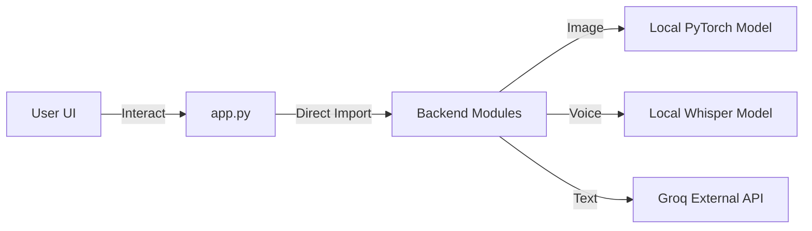

# 🌿 PlantDocBot – AI Plant Disease Diagnosis

**PlantDocBot** is a professional, AI-powered monolithic application for identifying plant diseases. It runs locally using **Streamlit** and combines offline Deep Learning models with online LLM capabilities to provide accurate diagnoses via Image, Voice, or Text.

---

## ✨ Key Features

### 1. 📷 Image Diagnosis (Offline / Local)
- **Model:** ResNet50 (PyTorch) trained on the PlantVillage dataset.
- **Function:** Upload a leaf image -> Model predicts the disease class locally.
- **Classes:** Supports **15 disease classes** (Tomato, Potato, Pepper).
- **Features:** Shows top-3 prediction confidence percentages.

### 2. 🎤 Voice assistant (Hybrid)
- **Transcription:** Uses **OpenAI Whisper (Local)** to transcribe speech to text on your device.
- **Analysis:** Uses **Groq API** to analyze the transcribed text and match it to known symptoms.
- **Requirements:** Requires `FFmpeg` installed on the system.

### 3. 💬 Text Diagnosis (Online)
- **Model:** **Groq API** (using `openai/gpt-oss-120b`).
- **Function:** Semantic search matching user descriptions (e.g., "brown spots with halos") to the disease database.
- **UI:** Dedicated "Diagnose" button to prevent accidental API calls.

### 4. ⚙️ Smart UI/UX
- **Single-Mode Logic:** Only one diagnosis mode is active at a time to prevent confusion.
- **Dynamic Reset:** "🔄 New Diagnosis" completely wipes all state, including sticky file uploaders and text inputs.
- **Light Theme:** Enforced professional white background via config.

---

## 🏗️ Architecture

This is a **monolithic Streamlit application**, not a client-server API architecture.

- **Frontend:** Streamlit (`app.py`) handles the UI rendering.
- **Backend Logic:** Python modules in `backend/` are imported directly.
- **No Internal API:** There are **no** Flask or FastAPI endpoints. The app runs as a single Python process.



---

## 🛠️ Tech Stack

| Component | Technology | Role |
|-----------|------------|------|
| **Core Framework** | Streamlit | UI & Application Logic |
| **Deep Learning** | PyTorch / Torchvision | Image Classification (ResNet50) |
| **Speech-to-Text** | OpenAI Whisper | Local Audio Transcription |
| **LLM / API** | Groq (`openai/gpt-oss-120b`) | Semantic Symptom Analysis |
| **Data Handling** | Pandas / JSON | Knowledge Base Management |

---

## 🚀 Installation & Setup

### 1. Prerequisites
- **Python 3.9+**
- **FFmpeg:** Required for Whisper to process audio files.
  - *Windows:* `winget install Gyan.FFmpeg` or separate install.
  - *Linux:* `sudo apt install ffmpeg`
- **Groq API Key:** Required for Text/Voice features. Get it from [Groq Console](https://console.groq.com).

### 2. Clone & Environment
```bash
git clone https://github.com/springboardmentor88888-mahaprasad/Intern-PlantChatBot-Project.git
cd Intern-PlantChatBot-Project

# Create Virtual Environment
python -m venv .venv
.venv\Scripts\activate  # Windows
# source .venv/bin/activate  # Mac/Linux
```

### 3. Install Dependencies
```bash
pip install -r requirements.txt
```

### 4. Configure API Key
Create a `.env` file in the root directory:
```bash
GROQ_API_KEY=gsk_your_actual_api_key_here
```

### 5. Run the Application
```bash
streamlit run app.py
```

---

## 📁 Project Structure

```
Intern-PlantChatBot-Project/
├── app.py                   # Main entry point (Streamlit UI)
├── requirements.txt         # Dependencies
├── .env                     # API Keys (GitIgnored)
├── .streamlit/
│   └── config.toml          # Theme configuration (White background)
├── backend/
│   ├── symptom_matcher.py   # Logic for matching text to diseases
│   ├── voice_handler.py     # Whisper AI transcription logic
│   ├── groq_fallback.py     # Groq API integration client
│   └── chatbot.py           # Helper for greeting/responses
├── knowledge/
│   ├── diseases.json        # Database of symptoms & treatments
│   └── treatments.py        # Helper to load disease data
└── models/
    └── resnet50_*.pth       # Trained PyTorch model checkpoint
```

---

## 🌱 Supported Diseases (Knowledge Base)

The system is optimized for **Tomato** plants but trained on a wider set:

- **Tomato:** Bacterial Spot, Early Blight, Late Blight, Leaf Mold, Septoria Leaf Spot, Spider Mites, Target Spot, Yellow Leaf Curl Virus, Mosaic Virus, Healthy.
- **Potato:** Early Blight, Late Blight, Healthy.
- **Pepper:** Bacterial Spot, Healthy.

---

## ⚠️ Troubleshooting

**1. "FFmpeg not found" error:**
   - Ensure FFmpeg is installed and added to your system PATH.
   - Restart the terminal after installing FFmpeg.

**2. "Model file not found":**
   - Ensure `models/resnet50_plantvillage_checkpoint.pth` exists. If you pulled from git, make sure LFS didn't truncate it (though this repo uses standard git storage).

**3. "Groq API Error":**
   - Check your `.env` file and ensure the API key is valid.

---

### Team
**Mentor:** Mahaprasad Jena
*Intern project for automated plant disease diagnosis.*
