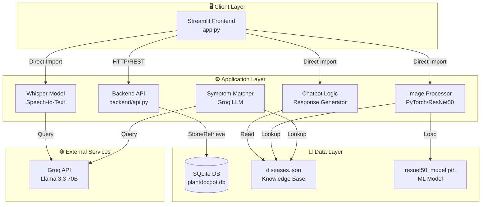
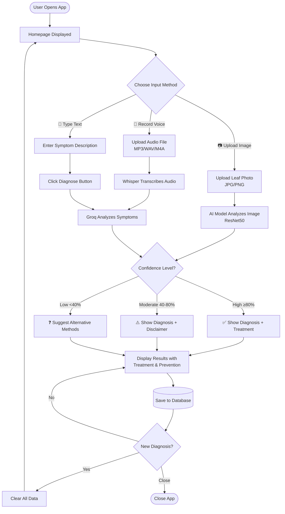
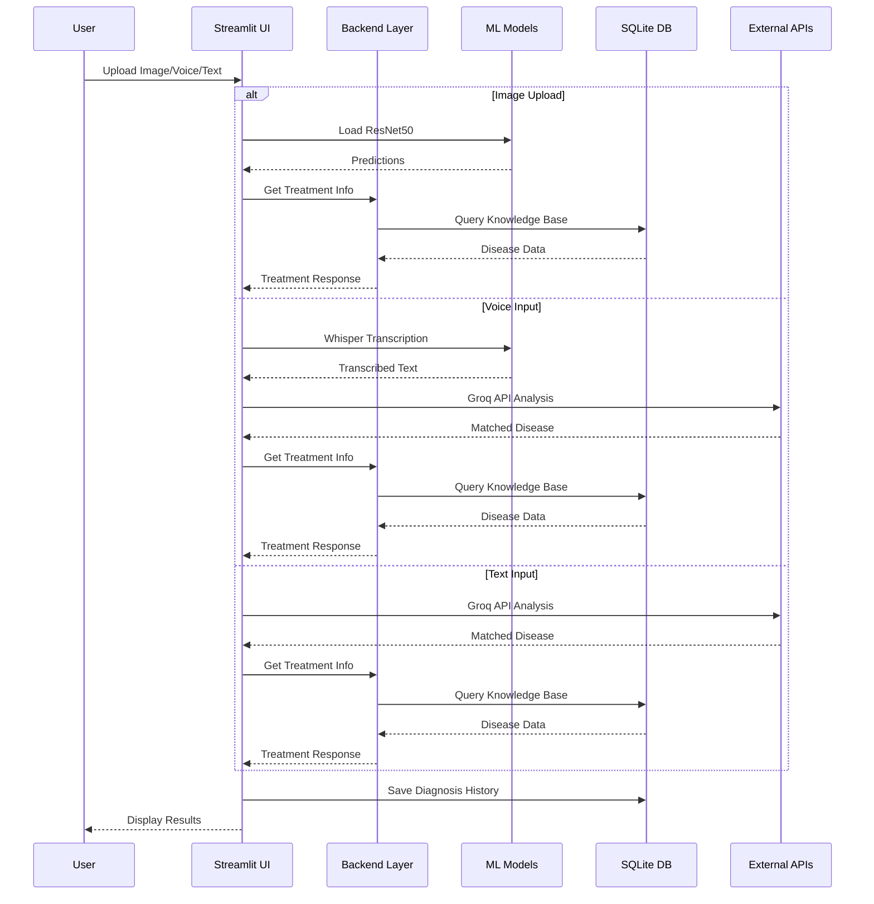

# 🌿 PlantDocBot – AI Plant Disease Diagnosis

**PlantDocBot** is a professional, AI-powered monolithic application for identifying plant diseases. It runs locally using **Streamlit** and combines offline Deep Learning models with online LLM capabilities to provide accurate diagnoses via Image, Voice, or Text.

---

## ✨ Key Features

### 1. 📷 Image Diagnosis (Offline / Local)
- **Model:** ResNet50 (PyTorch) trained on the PlantVillage dataset.
- **Function:** Upload a leaf image → Model predicts the disease class locally.
- **Classes:** Supports **15 disease classes** (Tomato, Potato, Pepper).
- **Features:** Shows top-3 prediction confidence percentages.

### 2. 🎤 Voice Assistant (Hybrid)
- **Transcription:** Uses **OpenAI Whisper (Local)** to transcribe speech to text on your device.
- **Analysis:** Uses **Groq API** to analyze the transcribed text and match it to known symptoms.
- **Requirements:** Requires `FFmpeg` installed on the system.

### 3. 💬 Text Diagnosis (Online)
- **Model:** **Groq API** (using `llama-3.3-70b-versatile`).
- **Function:** Semantic search matching user descriptions (e.g., "brown spots with halos") to the disease database.
- **UI:** Dedicated "Diagnose" button to prevent accidental API calls.

### 4. ⚙️ Smart UI/UX
- **Single-Mode Logic:** Only one diagnosis mode is active at a time to prevent confusion.
- **Dynamic Reset:** "🔄 New Diagnosis" completely wipes all state, including sticky file uploaders and text inputs.
- **Light Theme:** Enforced professional white background via config.

---

## 🏗️ System Architecture



---

## 👤 User Flow Diagram



---

## 🔄 Data Flow Diagram



---

## 📁 Project Structure

```
Intern-PlantChatBot-Project/
│
├── 📄 app.py                          # Main entry point - Streamlit UI
├── 📄 requirements.txt                # Python dependencies
├── 📄 .env                            # Environment variables (API keys) - GitIgnored
├── 📄 .env.example                    # Environment variables template
├── 📄 .gitignore                      # Git ignore rules
├── 📄 LICENSE                         # Project license
├── 📄 Dockerfile                      # Docker image definition
├── 📄 docker-compose.yml              # Docker Compose configuration
├── 📄 .dockerignore                   # Docker ignore rules
│
├── 📂 .streamlit/                     # Streamlit configuration
│   └── config.toml                    # Theme configuration (Light theme)
│
├── 📂 frontend/                       # Frontend module
│   ├── __init__.py                    # Module initialization
│   └── main.py                        # Additional frontend utilities
│
├── 📂 backend/                        # Backend business logic
│   ├── __init__.py                    # Module exports
│   ├── api.py                         # API endpoints and routing
│   ├── app.py                         # Flask/FastAPI application setup
│   ├── chatbot.py                     # Chatbot response generator
│   ├── symptom_matcher.py             # Text/voice symptom classification
│   ├── voice_handler.py               # Whisper audio transcription
│   └── groq_fallback.py               # Groq API integration
│
├── 📂 knowledge/                      # Disease knowledge base
│   ├── __init__.py                    # Module exports
│   ├── diseases.json                  # Disease definitions & symptoms
│   ├── treatments.py                  # Treatment lookup & formatting
│   └── unknown_cases.json             # Unknown case logging
│
├── 📂 database/                       # Database layer (SQLite)
│   ├── __init__.py                    # Module initialization
│   ├── db.py                          # Database connection & session
│   ├── models.py                      # SQLAlchemy ORM models
│   ├── seed.py                        # Database seeding
│   └── plantdocbot.db                 # SQLite database file
│
├── 📂 models/                         # Trained ML models
│   └── resnet50_plantvillage_checkpoint.pth  # PyTorch ResNet50 weights
│
├── 📂 testing_data/                   # Test data samples
│   ├── *.JPG                          # Sample leaf images
│   └── *.mp3                          # Sample audio files
│
├── 📂 .venv/                          # Python virtual environment
│
├── 📂 .git/                           # Git repository
│
├── 📄 train.ipynb                     # Model training notebook
└── 📄 train2.ipynb                    # Secondary training notebook
```

---

## 📂 Folder Explanations

### `/` (Root)
Main application and configuration files:

| File | Purpose |
|------|---------|
| `app.py` | Main Streamlit application entry point |
| `requirements.txt` | Python package dependencies |
| `.env` | Environment variables (API keys) - **GitIgnored** |
| `.env.example` | Template for environment variables |
| `.gitignore` | Git ignore patterns |
| `LICENSE` | Project license |
| `Dockerfile` | Docker image build configuration |
| `docker-compose.yml` | Docker Compose orchestration |
| `.dockerignore` | Files excluded from Docker context |
| `train.ipynb` | Model training notebook |
| `train2.ipynb` | Secondary training notebook |

### `/frontend/`
Frontend module containing:

| File | Purpose |
|------|---------|
| `__init__.py` | Module initialization |
| `main.py` | Additional frontend utilities and components |

### `/backend/`
Core business logic layer:

| File | Purpose |
|------|---------|
| `__init__.py` | Module exports and initialization |
| `api.py` | REST API endpoints and routing |
| `app.py` | Flask/FastAPI application setup |
| `chatbot.py` | Chatbot response generator |
| `symptom_matcher.py` | Text/voice symptom classification using Groq API |
| `voice_handler.py` | OpenAI Whisper integration for speech-to-text |
| `groq_fallback.py` | Groq API client for LLM-based classification |

**Key Functions:**
- `text_diagnosis()` - Classify symptoms from text input
- `process_voice_input()` - Process audio through Whisper + Groq pipeline
- `transcribe_audio()` - Convert speech to text locally
- `classify_symptoms_with_groq()` - LLM-based semantic disease matching

### `/knowledge/`
Structured disease database:

| File | Purpose |
|------|---------|
| `__init__.py` | Module exports |
| `diseases.json` | Disease definitions, symptoms, treatments, prevention |
| `treatments.py` | Treatment lookup with confidence-aware handling |
| `unknown_cases.json` | Logs unknown disease cases for review |

**Key Functions:**
- `get_treatment()` - Retrieve treatment info with confidence handling
- `format_treatment_response()` - Format treatment as markdown
- `get_uncertain_response()` - Handle low-confidence predictions
- `_log_unknown_case()` - Log unknown diseases for future improvement

### `/database/`
SQLite database persistence layer:

| File | Purpose |
|------|---------|
| `__init__.py` | Module initialization |
| `db.py` | Database connection and session management |
| `models.py` | SQLAlchemy ORM models |
| `seed.py` | Database seeding with initial data |
| `plantdocbot.db` | SQLite database file |

### `/models/`
Trained machine learning models:

| File | Purpose |
|------|---------|
| `resnet50_plantvillage_checkpoint.pth` | PyTorch ResNet50 trained on PlantVillage (15 classes) |

**Model Classes:**
1. Pepper__bell___Bacterial_spot
2. Pepper__bell___healthy
3. Potato___Early_blight
4. Potato___Late_blight
5. Potato___healthy
6. Tomato___Bacterial_spot
7. Tomato___Early_blight
8. Tomato___Late_blight
9. Tomato___Leaf_Mold
10. Tomato___Septoria_leaf_spot
11. Tomato___Spider_mites Two-spotted_spider_mite
12. Tomato___Target_Spot
13. Tomato___Tomato_Yellow_Leaf_Curl_Virus
14. Tomato___Tomato_mosaic_virus
15. Tomato___healthy

### `/testing_data/`
Sample test data:

| Content | Purpose |
|---------|---------|
| `*.JPG` | Sample leaf images for testing |
| `*.mp3` | Sample audio files for voice testing |

### `/.streamlit/`
Streamlit configuration:

| File | Purpose |
|------|---------|
| `config.toml` | UI theme configuration (colors, fonts, layout) |

**Theme Settings:**
- Base: Light
- Primary Color: #2e7d32 (Green)
- Background: #ffffff (White)
- Font: Sans Serif

---

## 🛠️ Tech Stack

| Component | Technology | Role |
|-----------|------------|------|
| **Core Framework** | Streamlit | UI & Application Logic |
| **Backend API** | Flask/FastAPI | REST API endpoints |
| **Deep Learning** | PyTorch / Torchvision | Image Classification (ResNet50) |
| **Speech-to-Text** | OpenAI Whisper | Local Audio Transcription |
| **LLM / API** | Groq (`llama-3.3-70b-versatile`) | Semantic Symptom Analysis |
| **Database** | SQLite / SQLAlchemy | Data persistence |
| **Data Handling** | Pandas / JSON | Knowledge Base Management |
| **Environment** | python-dotenv | Configuration management |
| **Containerization** | Docker / Docker Compose | Deployment |

---

## 🚀 Installation & Setup

### 1. Prerequisites
- **Python 3.9+**
- **FFmpeg:** Required for Whisper audio processing
  - *Windows:* `winget install Gyan.FFmpeg`
  - *Linux:* `sudo apt install ffmpeg`
  - *Mac:* `brew install ffmpeg`
- **Groq API Key:** Get from [Groq Console](https://console.groq.com)

### 2. Clone & Setup
```bash
git clone https://github.com/springboardmentor88888-mahaprasad/Intern-PlantChatBot-Project.git
cd Intern-PlantChatBot-Project

# Create Virtual Environment
python -m venv .venv
source .venv/bin/activate  # Linux/Mac
# .venv\Scripts\activate  # Windows
```

### 3. Install Dependencies
```bash
pip install -r requirements.txt
```

### 4. Configure Environment
```bash
# Copy example environment file
cp .env.example .env

# Edit .env with your API key
# GROQ_API_KEY=gsk_your_api_key_here
```

### 5. Run Application
```bash
streamlit run app.py
```

---

## 🐳 Docker Deployment

### Quick Start
```bash
# Copy environment file
cp .env.example .env
# Edit .env with your GROQ_API_KEY

# Build and run with Docker Compose
docker-compose up --build

# Access at http://localhost:8501
```

### Docker Commands
```bash
# Build image
docker build -t plantdocbot .

# Run container
docker run -p 8501:8501 \
  -e GROQ_API_KEY=gsk_your_key \
  -v $(pwd)/models:/app/models \
  plantdocbot

# Development mode with hot-reload
docker run -p 8501:8501 \
  -e GROQ_API_KEY=gsk_your_key \
  -v $(pwd):/app \
  plantdocbot
```

---

## 🌱 Supported Diseases

### Tomato (10 classes)
- 🦠 Bacterial Spot | 🍄 Early Blight | 🍄 Late Blight
- 🍄 Leaf Mold | 🍄 Septoria Leaf Spot
- 🕷️ Spider Mites (Two-spotted) | 🎯 Target Spot
- 🦠 Yellow Leaf Curl Virus | 🦠 Mosaic Virus
- ✅ Healthy

### Potato (3 classes)
- 🍄 Early Blight | 🍄 Late Blight | ✅ Healthy

### Pepper (2 classes)
- 🦠 Bacterial Spot | ✅ Healthy

---

## ⚙️ Configuration

### Environment Variables (.env)
```bash
# Required
GROQ_API_KEY=gsk_your_api_key_here

# Optional
STREAMLIT_SERVER_PORT=8501
STREAMLIT_SERVER_ADDRESS=0.0.0.0
STREAMLIT_BROWSER_GATHER_USAGE_STATS=false
```

### Streamlit Theme (.streamlit/config.toml)
```toml
[theme]
base="light"
primaryColor="#2e7d32"
backgroundColor="#ffffff"
secondaryBackgroundColor="#f0f2f6"
textColor="#000000"
font="sans serif"

[server]
port=8501
address="0.0.0.0"
```

---

## 📊 API Usage

### Backend Functions

```python
# Image Diagnosis
from backend import text_diagnosis
disease_key = text_diagnosis("brown spots with yellow halos")
# Returns: "Tomato___Early_blight"

# Voice Processing
from backend import process_voice_input
result = process_voice_input("/path/to/audio.mp3")
# Returns: {
#     "transcription": "my tomato has brown spots",
#     "disease_key": "Tomato___Early_blight",
#     "error": None
# }

# Treatment Lookup
from knowledge import get_treatment, format_treatment_response
treatment = get_treatment("Tomato___Late_blight", confidence=0.85)
response = format_treatment_response("Tomato___Late_blight", confidence=0.85)
```

---

## ⚠️ Troubleshooting

| Issue | Solution |
|-------|----------|
| **"FFmpeg not found"** | Install FFmpeg and add to PATH |
| **"Model file not found"** | Verify `models/resnet50_*.pth` exists (~100MB) |
| **"Groq API Error"** | Check `.env` file for valid `gsk_` key |
| **Whisper download fails** | Check internet connection; model auto-downloads |
| **Docker exits immediately** | Check logs: `docker logs plantdocbot` |
| **Low confidence**** | Use clear, well-lit images; avoid shadows |

---

## 🔮 Future Improvements

### High Priority
- [ ] **User Authentication** - Login/signup with diagnosis history
- [ ] **Batch Processing** - Upload and process multiple images
- [ ] **Feedback Loop** - User feedback on diagnosis accuracy
- [ ] **Image Preprocessing** - Auto-rotation, blur detection, crop suggestions

### Medium Priority
- [ ] **Multi-language Support** - Hindi, Spanish translations
- [ ] **Weather Integration** - Disease prediction based on weather conditions
- [ ] **Treatment Tracking** - Mark treatments applied, set reminders
- [ ] **Mobile App** - React Native or Flutter application

### Low Priority
- [ ] **Analytics Dashboard** - Usage statistics and insights
- [ ] **Export Reports** - PDF diagnosis reports
- [ ] **Progressive Web App** - Offline capability
- [ ] **ONNX Optimization** - Mobile and edge deployment

---

## 🤝 Contributing

1. Fork the repository
2. Create feature branch: `git checkout -b feature/amazing-feature`
3. Commit changes: `git commit -m 'Add amazing feature'`
4. Push to branch: `git push origin feature/amazing-feature`
5. Open a Pull Request

---

## 📄 License

MIT License - see [LICENSE](LICENSE) file

---

## 👥 Team

**Mentor:** Mahaprasad Jena  
**Project:** AI Plant Disease Diagnosis System

---

## 🙏 Acknowledgments

- [PlantVillage Dataset](https://github.com/spMohanty/PlantVillage-Dataset)
- [Groq](https://groq.com) - LLM API
- [Streamlit](https://streamlit.io) - UI Framework
- [PyTorch](https://pytorch.org) - Deep Learning
- [OpenAI Whisper](https://github.com/openai/whisper) - Speech Recognition

---

**Happy Plant Diagnosing! 🌱🤖**
